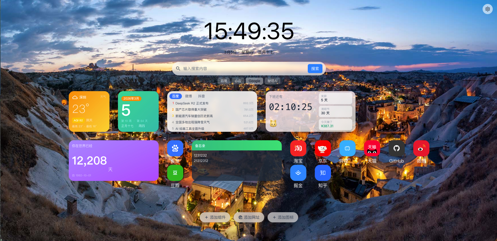
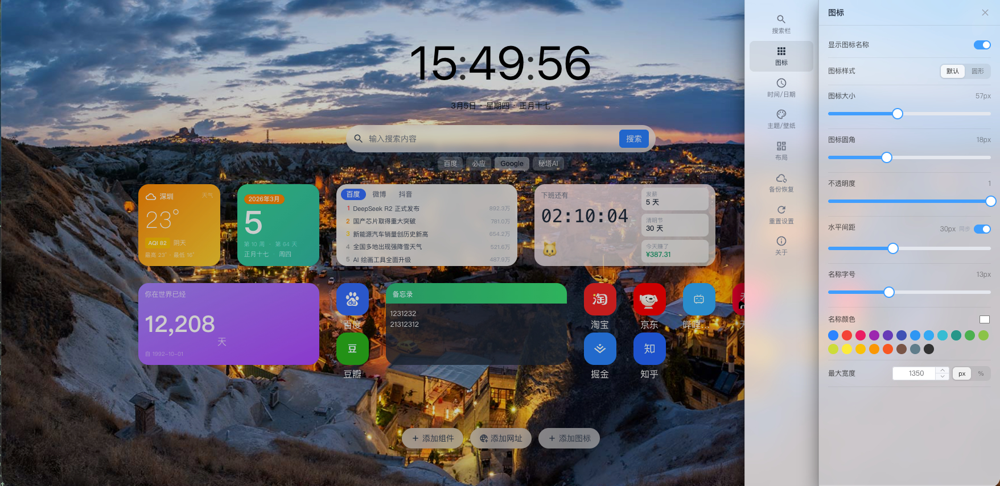

# AItabs — 你的 AI 新标签页

> 现在很多的 XXTab 要么收费，要么就是假开源，GitHub 上都是编译后的代码。  
> 既然 AI 这么发达，为什么不直接 Vibe 一个 tab 页呢？于是就有了 **AItabs**。

目前还处于早期阶段，如果你有其他想法也可以参与进来，一起 Vibe！

---

## 截图




---

## 功能特性

- 🔍 多搜索引擎切换（百度 / Google / Bing 等，可自定义）
- 🖼️ 壁纸系统（默认 / Bing 每日 / 自定义 URL / 本地上传）
- 🌗 深色 / 浅色模式，支持跟随系统
- 🧩 组件卡片：天气、日历、热搜榜、倒计时、备忘录、电影日历、纪念日
- 🔗 网址图标管理（添加 / 编辑 / 文件夹分组）
- ✏️ 编辑模式：抖动动画 + 一键删除，支持撤销
- ☁️ 账号同步（可选，需自行部署后端）
- 💾 本地备份 / 恢复（JSON 导入导出）

---

## 快速开始（本地开发）

### 前置要求

- Node.js >= 18
- npm >= 9
- （可选）Bun >= 1.0（用于运行后端）

### 前端

```bash
# 安装依赖
npm install

# 启动开发服务器（默认 http://localhost:5173）
npm run dev

# 构建生产产物
npm run build
```

### 后端（可选，账号同步功能需要）

```bash
cd backend

# 安装依赖（需要 Bun）
bun install

# 执行数据库迁移
bun src/db/migrate.ts

# 启动后端服务（默认 http://localhost:3000）
bun run dev
```

---

## 部署

### 方式一：Docker Compose（推荐，前后端一键部署）

适合有服务器、希望同时部署前端和账号同步后端的用户。

**1. 克隆项目**

```bash
git clone https://github.com/your-repo/AItabs.git
cd AItabs
```

**2. 配置环境变量**

在项目根目录创建 `.env` 文件：

```env
# 后端 JWT 密钥，请替换为随机字符串
JWT_SECRET=your_random_secret_here

# 前端访问地址（用于 CORS），替换为你的实际域名或 IP
FRONTEND_URL=http://your-domain.com

# 前端对外暴露的端口（默认 80）
PORT=80
```

**3. 启动服务**

```bash
docker compose up -d
```

启动后访问 `http://your-domain.com` 即可。

**4. 数据持久化**

SQLite 数据库文件会自动挂载到项目根目录的 `./data/` 目录下，重启容器数据不会丢失。

**5. 停止 / 更新**

```bash
# 停止
docker compose down

# 拉取最新代码后重新构建并启动
git pull
docker compose up -d --build
```

---

### 方式二：仅部署前端（纯静态，无需后端）

如果你只需要本地书签 / 组件功能，不需要账号同步，可以将前端构建产物部署到任意静态托管平台。

**构建**

```bash
npm install
npm run build
# 产物在 dist/ 目录
```

**Nginx 示例**

```nginx
server {
    listen 80;
    root /path/to/AItabs/dist;
    index index.html;

    location / {
        try_files $uri $uri/ /index.html;
    }
}
```

**Vercel / Netlify**

项目根目录已包含 `vercel.json`，直接导入 Vercel 项目即可一键部署。

---

### 方式三：浏览器扩展（开发中）

后续计划打包为 Chrome / Edge 扩展，敬请期待。

---

## 环境变量说明

| 变量名 | 必填 | 默认值 | 说明 |
|--------|------|--------|------|
| `JWT_SECRET` | 后端必填 | — | JWT 签名密钥，建议使用 32 位以上随机字符串 |
| `FRONTEND_URL` | 后端必填 | `http://localhost` | 前端访问地址，用于后端 CORS 白名单 |
| `PORT` | 否 | `80` | 前端容器对外暴露的端口 |
| `DB_PATH` | 否 | `/app/data/aitabs.db` | SQLite 数据库文件路径 |

---

## 技术栈

| 层 | 技术 |
|----|------|
| 前端框架 | Vue 3 + TypeScript |
| 构建工具 | Vite 7 |
| 样式 | Tailwind CSS v4 + 自定义 CSS |
| UI 组件 | Element Plus |
| 状态管理 | Pinia + pinia-plugin-persistedstate |
| 本地存储 | localStorage + IndexedDB（Dexie） |
| 后端框架 | Bun + Hono |
| 数据库 | SQLite（Drizzle ORM） |
| 容器化 | Docker + Nginx |

---

## 贡献

欢迎提 Issue 和 PR！项目处于早期阶段，任何想法都可以讨论。
